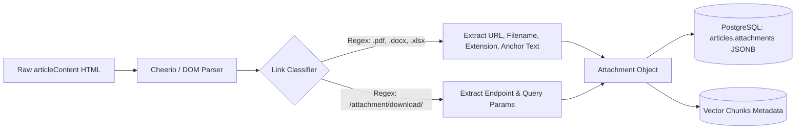

# Architectural Specification: SakaHub Article Attachment Extraction Pipeline

This document details the data extraction pipeline and database schema additions for discovering, extracting, and indexing embedded file attachments and downloadable links from SakaHub articles during the next re-indexing cycle.

---

## 1. Context & Dataset Analysis

In the SakaHub API envelope (`saka-content.json`), articles do not contain a dedicated top-level array such as `attachments: []`.
Instead, attachments are embedded directly as HTML hyperlink tags (`<a href="...">`) or text download references within the `articleContent` string.

### Analysis Statistics:
- **Total Articles Analyzed**: 992 articles.
- **Articles with Detected Attachment / Download Patterns**: 142 articles (~14.3%).
- **Common File Formats**: `.pdf`, `.docx`, `.xlsx`, `.zip`, `.csv`.
- **Target URL Endpoints**:
  - SakaHub attachment storage: `/api/v1/attachments/download/...`
  - Internal portal files: `https://sakahub.safaricom.co.ke/documents/...`
  - Safaricom enterprise document repositories.

---

## 2. Extraction Pipeline Architecture



---

## 3. Link Extraction Logic

When processing raw article content in `backend/src/services/ingestion.ts` (or `syncer.ts`):

```typescript
import * as cheerio from 'cheerio';

export interface ArticleAttachment {
  url: string;
  filename: string;
  fileType: 'pdf' | 'docx' | 'xlsx' | 'zip' | 'csv' | 'unknown';
  label: string;
  surroundingContext?: string;
}

const ATTACHMENT_REGEX = /\.(pdf|docx?|xlsx?|zip|csv)(\?.*)?$/i;
const ENDPOINT_ATTACHMENT_REGEX = /\/(?:attachment|download|file|document)\//i;

export function extractArticleAttachments(htmlContent: string): ArticleAttachment[] {
  if (!htmlContent) return [];
  const $ = cheerio.load(htmlContent);
  const attachments: ArticleAttachment[] = [];
  const seenUrls = new Set<string>();

  $('a[href]').each((_, el) => {
    const href = $(el).attr('href')?.trim();
    if (!href || seenUrls.has(href)) return;

    const isDirectFile = ATTACHMENT_REGEX.test(href);
    const isAttachmentEndpoint = ENDPOINT_ATTACHMENT_REGEX.test(href);

    if (isDirectFile || isAttachmentEndpoint) {
      seenUrls.add(href);
      const text = $(el).text().trim() || 'Download Attachment';
      const extMatch = href.match(/\.(pdf|docx?|xlsx?|zip|csv)/i);
      const ext = (extMatch ? extMatch[1].toLowerCase() : 'unknown') as ArticleAttachment['fileType'];

      // Extract filename from URL or anchor text
      const urlParts = href.split('/');
      const rawName = urlParts[urlParts.length - 1].split('?')[0];
      const filename = rawName.includes('.') ? decodeURIComponent(rawName) : `${text}.${ext !== 'unknown' ? ext : 'bin'}`;

      // Capture surrounding paragraph context for RAG chunk relevance
      const surroundingContext = $(el).closest('p, li, div').text().trim().slice(0, 200);

      attachments.push({
        url: href,
        filename,
        fileType: ext,
        label: text,
        surroundingContext,
      });
    }
  });

  return attachments;
}
```

---

## 4. PostgreSQL Database Schema Additions

During the next database migration:

```sql
-- Add attachments JSONB array to articles table
ALTER TABLE articles ADD COLUMN IF NOT EXISTS attachments JSONB DEFAULT '[]'::jsonb;
CREATE INDEX IF NOT EXISTS idx_articles_has_attachments ON articles USING gin(attachments);
```

### Sample Record:
```json
[
  {
    "url": "https://sakahub.safaricom.co.ke/api/v1/attachments/download/SIM_Swap_Form_v2.pdf",
    "filename": "SIM_Swap_Form_v2.pdf",
    "fileType": "pdf",
    "label": "Download SIM Replacement Verification Form",
    "surroundingContext": "For high-value corporate SIM replacements, attach the signed form below before submitting to the escalation desk."
  }
]
```

---

## 5. UI Integration (When Reingested)

1. **Citation & Source Inspector**:
   - When viewing an article citation in `CitationHoverCard` or `CitationInspectorPane`, render an **Attachments Section**:
     ```tsx
     {article.attachments?.map((att) => (
       <a href={att.url} target="_blank" rel="noopener noreferrer" className="saka-attachment-chip">
         <Paperclip size={12} />
         <span>{att.filename}</span>
         <ExternalLink size={10} />
       </a>
     ))}
     ```
2. **AI Answer Citations**:
   - When the user asks e.g. "Where can I download the reversal form?", the RAG pipeline provides the exact direct download URL from the indexed attachments metadata.
